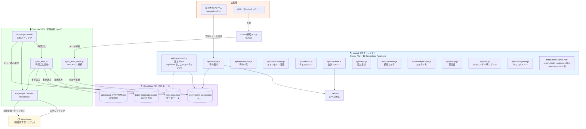
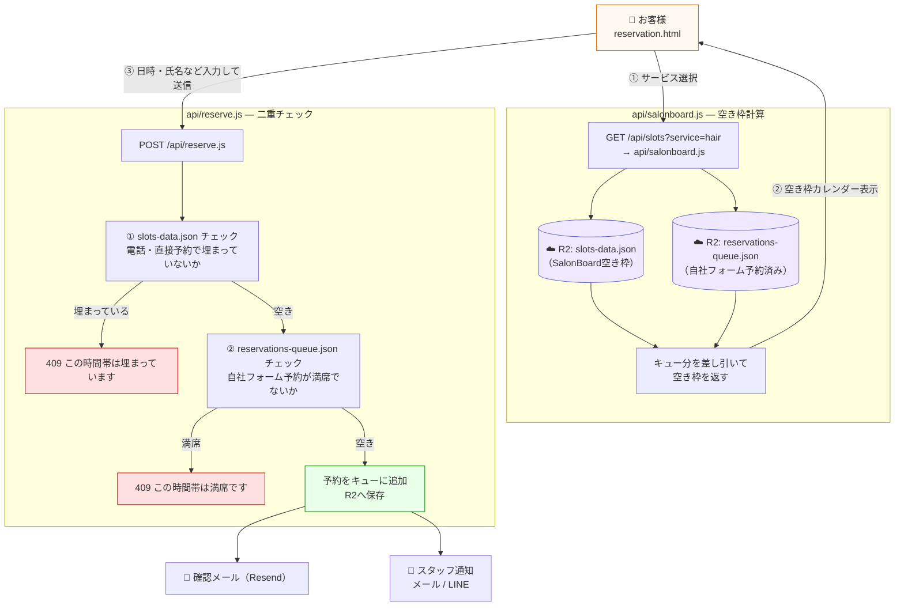
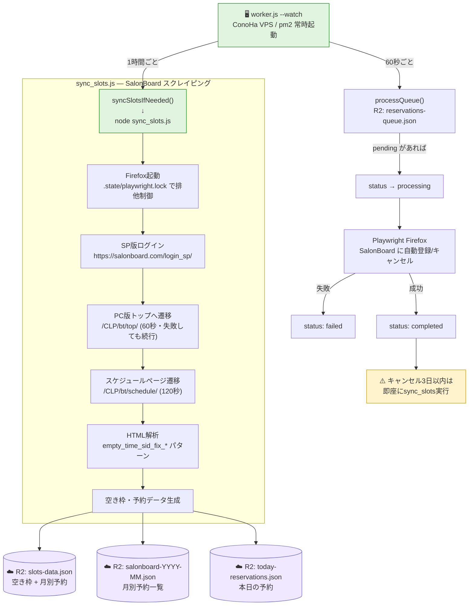
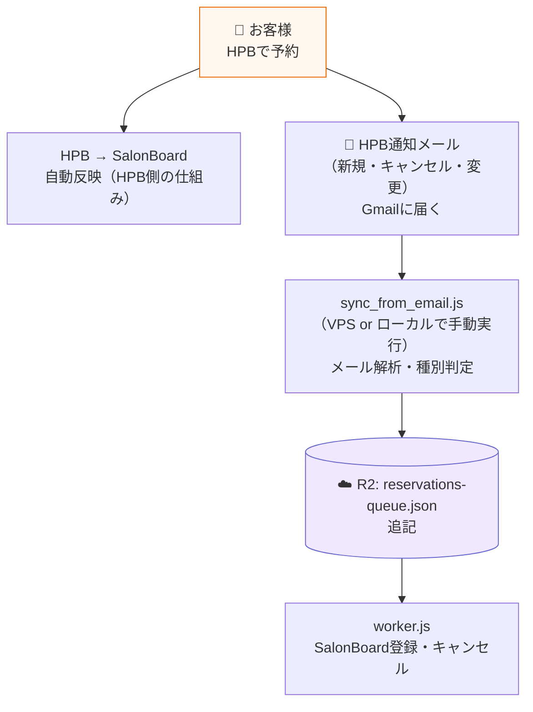

# HPB予約システム 全体図

> **2026-05-28 更新**: Vercel Blob → Cloudflare R2 移行完了 / ローカルPC → ConoHa VPS（pm2常時起動）移行完了 / GitHub Actions 廃止

---

## 全体アーキテクチャ



---

## 1. 予約受付フロー（自社フォーム）



---

## 2. SalonBoard 登録フロー（worker.js — ConoHa VPS）



---

## 3. HPB経由フロー



---

## ファイル対応表

| ファイル | 役割 | 状態 |
|---|---|---|
| `reservation.html` | 自社予約フォーム（Vercel ホスト） | ✅ 完成 |
| `admin.html` | スタッフ用予約管理画面（パスワード保護） | ✅ 完成 |
| `register.html` | スタッフ登録・顧客カルテ管理 | ✅ 完成 |
| `report.html` | 売上レポート（支払い別・日別・リピート率） | ✅ 完成 |
| `customers.html` | 顧客カルテ一覧 | ✅ 完成 |
| `api/reserve.js` | 予約受付（R2二重チェック＋確認メール＋スタッフ通知） | ✅ |
| `api/salonboard.js` | 空き枠API（`/api/slots` もvercel.jsonでここへルーティング） | ✅ |
| `api/reservations.js` | 予約一覧取得（管理画面用） | ✅ |
| `api/admin-action.js` | キャンセル・変更処理（管理画面用） | ✅ |
| `api/checkin.js` | チェックイン処理 | ✅ |
| `api/checkout.js` | 会計完了・サンクスメール | ✅ |
| `api/sales.js` | 売上集計API | ✅ |
| `api/customers.js` | 顧客カルテ API | ✅ |
| `api/customer-note.js` | カルテメモAPI | ✅ |
| `api/receipt.js` | 領収書API | ✅ |
| `api/cron.js` | Vercel Cron（前日リマインダー / 朝レポート） | ✅ |
| `api/comingsoon.js` | カミングスーン管理 | ✅ |
| `sync_slots.js` | SalonBoard空き枠スクレイピング → R2保存（Firefox/Playwright） | ✅ |
| `sync_from_email.js` | HPBメール解析 → R2キュー更新 | ✅ |
| `sync_comingsoon.js` | カミングスーン同期 | ✅ |
| `worker.js` | 予約SalonBoard登録・1時間ごとsync（VPS pm2常時起動） | ✅ |

> **Vercel Hobby Plan 上限**: Serverless Functions 12本。`api/slots.js` は削除済み（`vercel.json` で `/api/slots → /api/salonboard` にルーティング）。

---

## R2 データ構造（Cloudflare R2）

| ファイル名 | 内容 |
|---|---|
| `reservations-queue.json` | 自社フォーム予約キュー（status: pending / processing / completed / failed） |
| `slots-data.json` | SalonBoard空き枠（`{ slots, slotCounts, serviceSlots, activeStylists, slotsByDateRaw }`） |
| `salonboard-YYYY-MM.json` | 月別予約一覧（管理画面の日別予約参照用） |
| `today-reservations.json` | 本日の予約一覧（管理画面トップ用） |

---

## インフラ構成

| コンポーネント | 役割 | 備考 |
|---|---|---|
| **Vercel** | フロントエンド + Serverless API | Hobby Plan / 12関数上限 |
| **Cloudflare R2** | ストレージ（全JSONデータ） | 旧: Vercel Blob |
| **ConoHa VPS** | worker.js 常時起動 + sync_slots.js | pm2で管理 |
| **SalonBoard** | 美容室管理システム | Playwright/Firefoxで自動操作 |
| **Resend** | メール送信 | 確認メール・スタッフ通知 |

---

## 日常オペレーション

```bash
# HPBからメールが来たとき（emails/ に .txt で保存してから）
npm run sync
# → 新規/キャンセル/変更を自動判定してR2キューを更新

# 空き枠データを手動同期（通常はVPSが1時間ごと自動実行）
npm run sync:slots

# VPS上でのworker起動（pm2で管理）
pm2 start "node worker.js --watch" --name hpb-worker
pm2 logs hpb-worker
```

## .env 設定項目

```
SALONBOARD_LOGIN_ID=xxx          # SalonBoard ログインID
SALONBOARD_PASSWORD=xxx          # SalonBoard パスワード
R2_ACCOUNT_ID=xxx                # Cloudflare R2 アカウントID
R2_ACCESS_KEY_ID=xxx             # R2 アクセスキー
R2_SECRET_ACCESS_KEY=xxx         # R2 シークレットキー
R2_BUCKET_NAME=xxx               # R2 バケット名
ADMIN_PASSWORD=xxx               # 管理画面パスワード
RESEND_API_KEY=xxx               # メール送信API
MAIL_FROM=xxx                    # 送信元アドレス
CRON_SECRET=xxx                  # Cron 認証トークン
STAFF_NOTIFY_EMAIL=xxx           # スタッフ通知先メール（省略可）
LINE_CHANNEL_ACCESS_TOKEN=xxx    # LINE Messaging API（省略可）
LINE_OWNER_USER_ID=xxx           # LINEオーナーID（省略可）
```
