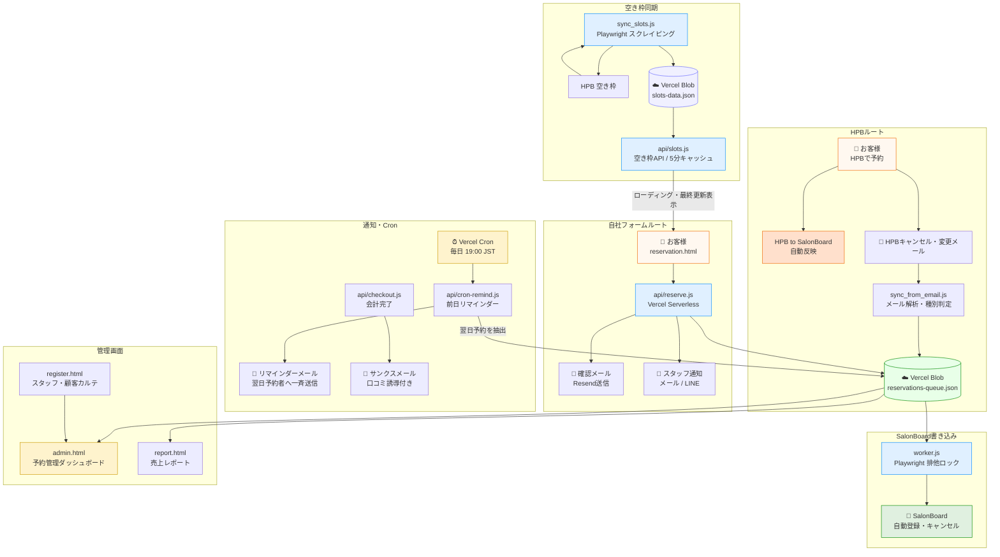

# HPB予約システム 全体図



## ファイル対応表

| ファイル | 役割 | 状態 |
|---|---|---|
| `reservation.html` | 自社予約フォーム（Vercel ホスト） | ✅ 完成 |
| `admin.html` | スタッフ用予約管理画面（パスワード保護） | ✅ 完成 |
| `register.html` | スタッフ登録・顧客カルテ管理 | ✅ 完成 |
| `report.html` | 売上レポート（支払い別グラフ＋日別トレンドグラフ） | ✅ 完成 |
| `api/reserve.js` | 予約受付（Blob保存＋確認メール＋スタッフ通知） | ✅ 完成 |
| `api/checkout.js` | 会計完了時サンクスメール送信 | ✅ 完成 |
| `api/cron-remind.js` | 前日リマインダー Cron（毎日 19:00 JST） | ✅ 完成 |
| `api/reservations.js` | 予約一覧取得（管理画面用） | ✅ 完成 |
| `api/admin-action.js` | キャンセル・変更処理（管理画面用） | ✅ 完成 |
| `api/customers.js` | 顧客カルテ API | ✅ 完成 |
| `sync_from_email.js` | HPBメール解析 → Blob キュー更新 | ✅ 完成 |
| `api/slots.js` | 空き枠データをVercel Blobから返すAPI（5分キャッシュ） | ✅ 完成 |
| `sync_slots.js` | HPB空き枠スクレイピング → Blob保存 | ✅ 完成 |
| `worker.js` | 自社フォーム予約をSalonBoardに登録・キャンセル | ✅ 完成 |
| `import_from_email.js` | HPBメール → SalonBoard直接登録（旧フロー） | ✅ 完成 |
| `parse_calendar.js` | SalonBoardカレンダーHTMLを解析 | ✅ 完成 |
| 空き枠リアルタイム反映 | slots-data.json → api/slots.js → reservation.html カレンダー表示 | ✅ 完成 |

## 日常オペレーション

```bash
# HPBからメールが来たとき（emails/ に .txt で保存してから）
npm run sync
# → 新規/キャンセル/変更を自動判定してBlobキューを更新

# 空き枠データを今月・来月分同期（予約フォームのカレンダー表示に反映）
npm run sync:slots
# 3ヶ月分取得する場合
npm run sync:slots:3months

# 自社フォームからの予約をSalonBoardに登録（PC起動時）
npm run worker

# VPS運用時（常時監視）
npm run worker:watch
```

## アクセスURL（Vercel デプロイ後）

| URL | 用途 |
|---|---|
| `https://xxx.vercel.app/` | お客様向け予約フォーム |
| `https://xxx.vercel.app/admin` | スタッフ用管理画面（パスワード保護） |

## .env 設定項目

```
SALONBOARD_LOGIN_ID=xxx      # SalonBoard ログインID（worker.js 用）
SALONBOARD_PASSWORD=xxx      # SalonBoard パスワード（worker.js 用）
BLOB_READ_WRITE_TOKEN=xxx    # Vercel Blob トークン
ADMIN_PASSWORD=xxx           # 管理画面パスワード
RESEND_API_KEY=xxx           # メール送信API
MAIL_FROM=xxx                # 送信元アドレス
CRON_SECRET=xxx              # Cron 認証トークン（省略可）
STAFF_NOTIFY_EMAIL=xxx       # スタッフ通知先メール（省略可）
LINE_NOTIFY_TOKEN=xxx        # LINE Notify トークン（省略可）
```
