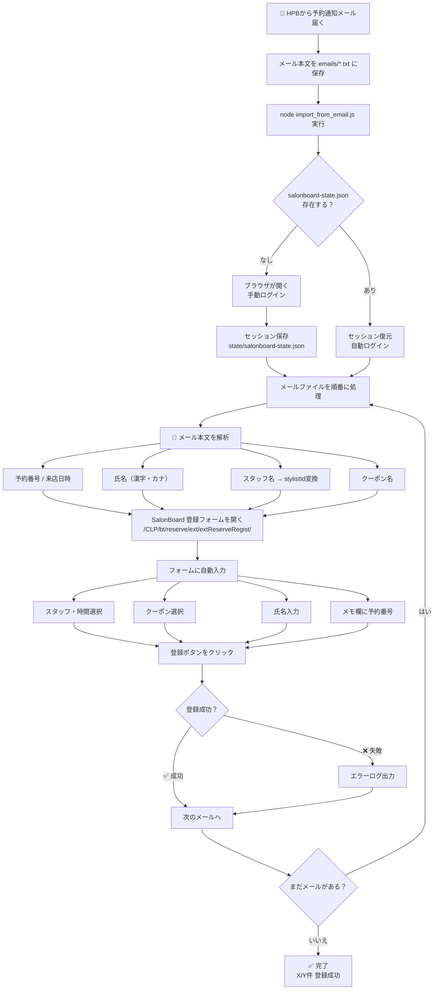

# HPB → 自社サイト（SalonBoard）自動登録フロー

> HPB（Hot Pepper Beauty）でお客様が予約 → メール通知 → 自社SalonBoardカレンダーに自動登録

## 関連ファイル

| ファイル | 役割 |
|---|---|
| `emails/*.txt` | HPBメール本文を保存する場所 |
| `import_from_email.js` | メール解析 → SalonBoard一括登録 |
| `parse_calendar.js` | カレンダーHTMLを解析して予約枠をJSON出力 |
| `register_reservation.js` | 単体で1件だけ登録する場合に使用 |
| `state/salonboard-state.json` | ログインセッション保存（自動生成） |
| `hpb-register.html` | 登録フォームの参考HTML |
| `hpb-reserve-calendar.html` | カレンダーの参考HTML |
